<div align="center">

# 🤖 AI DevOps Copilot

[](https://github.com/dankbhardwaj/ai-devops-copilot/actions)
[](https://hub.docker.com/r/dankbhardwaj/ai-devops-copilot)
[](https://kubernetes.io/)
[](https://fastapi.tiangolo.com/)
[](https://opensource.org/licenses/MIT)
[](https://www.python.org/)

**A production-grade LLMOps system integrating RAG, LLM inference, containerization, Kubernetes orchestration, and automated CI/CD pipelines.**

[📖 Documentation](#-architecture) • [🚀 Quick Start](#-quick-start) • [🛠 API Reference](#-api-reference) • [🤝 Contributing](#-contributing)

---

</div>

## 📌 Table of Contents

- [Overview](#-overview)
- [Architecture](#-architecture)
- [Tech Stack](#-tech-stack)
- [System Flow Diagrams](#-system-flow-diagrams)
- [CI/CD Pipeline](#-cicd-pipeline)
- [Kubernetes Deployment Strategy](#-kubernetes-deployment-strategy)
- [Quick Start](#-quick-start)
- [Docker Usage](#-docker-usage)
- [Kubernetes Setup](#-kubernetes-setup)
- [API Reference](#-api-reference)
- [Project Structure](#-project-structure)
- [DevOps Capabilities](#-devops-capabilities)
- [Screenshots](#-screenshots)
- [Resume Summary](#-resume-summary)
- [Author](#-author)

---

## 🧠 Overview

**AI DevOps Copilot** is a **Retrieval-Augmented Generation (RAG)** assistant specialized in answering DevOps, Kubernetes, and cloud infrastructure questions. It combines semantic search with large language model inference to deliver accurate, context-aware responses.

This project is a complete **end-to-end LLMOps demonstration** covering:

- 🔍 **Intelligent retrieval** from a vector database (ChromaDB)
- 🧠 **Local LLM inference** via Ollama (no cloud API costs)
- ⚡ **High-performance REST API** using FastAPI
- 🐳 **Containerized** with Docker for portability
- ☸️ **Orchestrated** on Kubernetes with zero-downtime deployments
- 🔁 **Fully automated CI/CD** with GitHub Actions

---

## 🏗 Architecture

### High-Level System Architecture


---

## 🛠 Tech Stack

| Category | Technology | Purpose |
|---|---|---|
| **API Framework** |  | REST API server & Swagger UI |
| **LLM Runtime** |  | Local LLM inference engine |
| **LLM Models** | TinyLlama / Phi3 / Llama3 | Language model backends |
| **Vector DB** | ChromaDB | Semantic context retrieval |
| **Containerization** |  | Application packaging |
| **Orchestration** |  | Container orchestration |
| **Local K8s** | kind (K8s in Docker) | Local cluster for development |
| **CI/CD** |  | Automated pipelines |
| **Runner** | Self-hosted GitHub Runner | Pipeline execution agent |
| **Registry** |  | Container image registry |
| **Language** |  | Application language |

---

## 🔄 System Flow Diagrams

### RAG Query Processing Pipeline


---

### Component Interaction Map


---

## 🔁 CI/CD Pipeline

### GitHub Actions Workflow

```mermaid
flowchart TD
    A([👨‍💻 Developer\nPushes Code]) -->|git push origin main| B

    subgraph GHA["🔧 GitHub Actions Cloud"]
        B[Trigger Workflow\ngithub.event: push]
        B --> C{Branch Check\nbranch == 'main'?}
        C -->|❌ No| Z([Skip Deployment])
        C -->|✅ Yes| D[Checkout Repository\nactions/checkout@v3]
        D --> E[Set up Docker Buildx\ndocker/setup-buildx-action]
        E --> F[Login to Docker Hub\ndocker/login-action]
    end

    subgraph RUNNER["🖥️ Self-Hosted Runner"]
        F --> G[Build Docker Image\ndocker build -t app:SHA]
        G --> H{Build\nSuccess?}
        H -->|❌ Fail| FAIL([🚨 Notify Failure\nPipeline Aborted])
        H -->|✅ Pass| I[Tag with Commit SHA\n& 'latest']
        I --> J[Push to Docker Hub\ndocker push]
        J --> K[Update K8s Deployment\nkubectl set image]
        K --> L[Rolling Update Triggered\nKubernetes Scheduler]
    end

    subgraph K8S["☸️ Kubernetes Cluster"]
        L --> M[Old Pod: Terminating]
        L --> N[New Pod: Pulling Image]
        N --> O{Health Check\nReadiness Probe}
        O -->|❌ Fail| P[Rollback Initiated\nPrevious Version Restored]
        O -->|✅ Pass| Q([🟢 Deployment Live\nZero Downtime])
    end

    style GHA fill:#1a1a2e,stroke:#4fc3f7,color:#fff
    style RUNNER fill:#0d1b2a,stroke:#e94560,color:#fff
    style K8S fill:#1b2838,stroke:#326CE5,color:#fff
```



---

## ☸️ Kubernetes Deployment Strategy

### Rolling Update Architecture


---

### Kubernetes Resource Topology


---

## 🚀 Quick Start

### Prerequisites

```bash
# Required tools
docker --version       # Docker 24+
kubectl version        # Kubernetes CLI
kind version           # Kind 0.20+
ollama --version       # Ollama runtime
```

### 1️⃣ Clone Repository

```bash
git clone https://github.com/dankbhardwaj/ai-devops-copilot.git
cd ai-devops-copilot
```

### 2️⃣ Start Ollama & Pull Model

```bash
# Start Ollama service
ollama serve &

# Pull a lightweight model
ollama pull tinyllama
# OR for better quality:
ollama pull phi3
```

### 3️⃣ Run Locally

```bash
pip install -r requirements.txt
uvicorn app.main:app --host 0.0.0.0 --port 8000 --reload
```

Open: [http://localhost:8000/docs](http://localhost:8000/docs)

---

## 🐳 Docker Usage

### Build Image

```bash
docker build -t dankbhardwaj/ai-devops-copilot:latest .
```

### Run Container

```bash
docker run -d \
  --name ai-devops-copilot \
  -p 8000:8000 \
  --add-host=host.docker.internal:host-gateway \
  dankbhardwaj/ai-devops-copilot:latest
```

### Docker Compose (Recommended)

```bash
docker compose up -d
```

---

## ☸️ Kubernetes Setup

### Step 1 — Create Kind Cluster

```bash
kind create cluster --name dev
kubectl cluster-info --context kind-dev
```

### Step 2 — Load Image into Kind

```bash
kind load docker-image dankbhardwaj/ai-devops-copilot:latest --name dev
```

### Step 3 — Deploy to Kubernetes

```bash
kubectl apply -f k8s/
```

### Step 4 — Verify Deployment

```bash
# Check pods are running
kubectl get pods -l app=ai-devops-copilot

# Check deployment rollout
kubectl rollout status deployment/ai-devops-copilot

# Describe deployment
kubectl describe deployment ai-devops-copilot
```

### Step 5 — Access the Application

```bash
kubectl port-forward service/ai-devops-service 8000:8000
```

Open: [http://localhost:8000/docs](http://localhost:8000/docs)

---

## 🌐 API Reference

### `POST /ask`

Submit a question to the AI DevOps Copilot.

**Request:**
```json
{
  "question": "How do I perform a rolling update in Kubernetes?"
}
```

**Response:**
```json
{
  "answer": "To perform a rolling update in Kubernetes, you can update the image of your deployment using: kubectl set image deployment/<name> <container>=<new-image>. Kubernetes will then gradually replace old pods with new ones, ensuring zero downtime based on your maxUnavailable and maxSurge settings.",
  "context_used": true,
  "model": "tinyllama",
  "latency_ms": 842
}
```

### `GET /health`

Health check endpoint.

```json
{
  "status": "healthy",
  "vector_db": "connected",
  "ollama": "connected"
}
```

---

## 📁 Project Structure

```
ai-devops-copilot/
├── 📂 app/
│   ├── main.py              # FastAPI application entry point
│   ├── routes/
│   │   └── ask.py           # /ask endpoint handler
│   ├── rag/
│   │   ├── retriever.py     # ChromaDB vector search
│   │   ├── embedder.py      # Embedding model wrapper
│   │   └── prompt.py        # Prompt template builder
│   └── llm/
│       └── ollama_client.py # Ollama API client
├── 📂 data/
│   └── knowledge_base/      # DevOps & K8s documentation
├── 📂 k8s/
│   ├── deployment.yaml      # Kubernetes Deployment manifest
│   ├── service.yaml         # Kubernetes Service manifest
│   └── hpa.yaml             # HorizontalPodAutoscaler
├── 📂 .github/
│   └── workflows/
│       └── deploy.yml       # GitHub Actions CI/CD pipeline
├── Dockerfile               # Multi-stage Docker build
├── docker-compose.yml       # Local development stack
├── requirements.txt         # Python dependencies
└── README.md
```

---

## 🎯 DevOps Capabilities Demonstrated


---

## 📸 Screenshots

### 🌐 FastAPI Swagger UI
> Interactive API documentation auto-generated at `/docs`. Live `POST /ask` endpoint ready for testing with full request/response schema.


---

### 🔁 GitHub Actions CI/CD Pipeline
> Every push to `main` automatically triggers: Docker image build → SHA tag → Docker Hub push → `kubectl set image` → rolling update. Full automation, zero manual steps.


---

### ☸️ Kubernetes Pods Running
> Successful deployment confirmed. All pods in `Running` state with correct image version pulled from Docker Hub and healthy readiness probes passing.


---

### 🔄 Kubernetes Rolling Update
> Live rolling update in action — new pods spin up while old pods gracefully terminate. `maxUnavailable: 25%` and `maxSurge: 25%` ensure zero downtime throughout the entire update cycle.


---

## 🏆 Resume Summary

> Built a **production-style LLMOps system** integrating Retrieval-Augmented Generation (RAG), FastAPI, Docker, Kubernetes, and fully automated CI/CD with rolling deployments. Demonstrated end-to-end ownership from LLM inference to zero-downtime production delivery using self-hosted GitHub Actions runners, ChromaDB vector search, and Ollama for local model inference.

**Key achievements:**
- ✅ End-to-end RAG pipeline with ChromaDB and local LLM (Ollama)
- ✅ Dockerized AI application with multi-stage builds and SHA-tagged versioning
- ✅ Kubernetes orchestration on Kind with zero-downtime rolling updates
- ✅ Fully automated CI/CD pipeline with self-hosted GitHub Actions runner
- ✅ Production-ready API with health checks and Swagger documentation

---

## 📌 Repository

🔗 [https://github.com/dankbhardwaj/ai-devops-copilot](https://github.com/dankbhardwaj/ai-devops-copilot)

---

## 🤝 Contributing

1. Fork the repository
2. Create your feature branch (`git checkout -b feature/amazing-feature`)
3. Commit your changes (`git commit -m 'feat: add amazing feature'`)
4. Push to the branch (`git push origin feature/amazing-feature`)
5. Open a Pull Request

---

## 📄 License

This project is licensed under the MIT License — see the [LICENSE](LICENSE) file for details.

---

<div align="center">

## 👨‍💻 Author

**Bhaskar Sharma**

*DevOps | LLMOps | Kubernetes | CI/CD | AI Infrastructure*

[](https://github.com/dankbhardwaj)
[](https://linkedin.com/in/dankbhardwaj)

---

⭐ **Star this repo** if you found it useful!

*Built with ❤️ for the DevOps & AI community*

</div>
